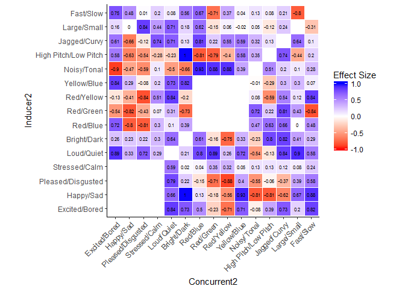
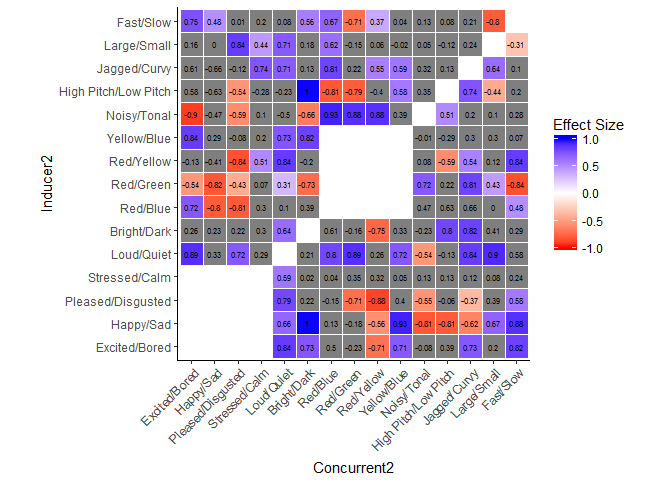

# Descriptive Statistics
Alan Nielsen  
12/9/2017  

Days have past and it's finally here- our very first look at the data.

Although this section is labelled "Descriptive Statistics", it quickly became clear that there just aren't that many descriptive statistics to be done on this data that are of any real interest, so we're going to focus slightly more broadly on visualising and quanitfying our data.

Let's start by loading in our clean data and some libraries:


```r
cleandata <- read.csv(
"D:/Github/STE-PHEN/summer_school_sessions/11_descriptive_stats/cleandataN.csv")

library(plyr)
library(tidyverse)

maindata <- subset(cleandata, DataSet == "Main")
pilotdata <- subset(cleandata, DataSet == "Pilot")
```

There are lots of very basic statistics that we might want to take a look at first - in many experiments we'll want to know super simple things, like the grand mean response (or response-correctness). It's not particularly informative for our purposes, but the mean response in this dataset is 0.6125579 - which means that "High" stimuli were paired with other "High" stimuli 61.255787% of the time.

#Normality

Most often we will want to start by looking at the normality of the distributions of our data- in this case because the data is binomial and the number of trials is very low we know things won't be normally distributed, but lets take a look at the raw data anyways.

There are tons of tests of the normality of data in R, but I generally prefer visual inspection of a qqplot to any of them.


```r
ggplot(maindata, aes(sample = Response, colour= Condition)) + 
  stat_qq(aes(shape = Condition))+
  ggtitle("qq Plots of Data by Condition") +
  labs(x="", y="") +
  theme(axis.title.y = element_text(size=12,  color="#666666")) +
  theme(axis.text = element_text(size=8)) +
  theme(plot.title = element_text(size=16, face="bold", hjust=0, color="#666666")) +
  theme(strip.text.x = element_text(size = 8, colour = "black"))
```

<!-- -->

Not exactly normal (or possible to be normal) when looking at the raw data- obviously it is all 0s or 1s, so we need to aggregate the data in a number of ways and look at how its normality changes.

Below we'll aggregate the data per comparison and per subject, then output a new qqplot.

We'll also aggregate just per-subject and look at the same plot (and per-comparison)


```r
dataagg1 <- aggregate(Response ~ Comparison + Condition + Subject, data = maindata, mean)

ggplot(dataagg1, aes(sample = Response, colour= Condition)) + 
  stat_qq(aes(shape = Condition))+
  ggtitle("qq Plots of Data by Condition") +
  labs(x="", y="") +
  theme(axis.title.y = element_text(size=12,  color="#666666")) +
  theme(axis.text = element_text(size=8)) +
  theme(plot.title = element_text(size=16, face="bold", hjust=0, color="#666666")) +
  theme(strip.text.x = element_text(size = 8, colour = "black"))
```

<!-- -->

```r
dataagg2 <- aggregate(Response ~ Condition + Subject, data = maindata, mean)

ggplot(dataagg2, aes(sample = Response, colour= Condition)) + 
  stat_qq(aes(shape = Condition))+
  ggtitle("qq Plots of Data by Condition") +
  labs(x="", y="") +
  theme(axis.title.y = element_text(size=12,  color="#666666")) +
  theme(axis.text = element_text(size=8)) +
  theme(plot.title = element_text(size=16, face="bold", hjust=0, color="#666666")) +
  theme(strip.text.x = element_text(size = 8, colour = "black"))
```

<!-- -->

```r
dataagg3 <- aggregate(Response ~ Comparison + Condition, data = maindata, mean)
ggplot(dataagg3, aes(sample = Response, colour= Condition)) + 
  stat_qq(aes(shape = Condition))+
  ggtitle("qq Plots of Data by Condition") +
  labs(x="", y="") +
  theme(axis.title.y = element_text(size=12,  color="#666666")) +
  theme(axis.text = element_text(size=8)) +
  theme(plot.title = element_text(size=16, face="bold", hjust=0, color="#666666")) +
  theme(strip.text.x = element_text(size = 8, colour = "black"))
```

<!-- -->

So we have data in more bins now- there are possible values in our dataframe other than 0 and 1- but our distribution still isn't anywhere close to normal.

When we collapse to data aggregated per participant we get something slightly closer to a normal distribution, and finally when we collapse across participants and only look at Data from Condition and Comparison we are closer still, but obviously still have a hump at "1" and a smaller hump at "0".


#Means

Okay, with that slightly pointless test of normality out of the way, we can start to look at the actual data- we already know the grand mean is 0.6125579, but what did participants associate with what?

The first way we can look at this is just as a table of means


```r
dataagg4 <- aggregate(Response~Comparison, data=maindata, mean)
means<- as.data.frame(xtabs(Response ~ Comparison, data=dataagg4))

means
```

```
##              Comparison       Freq
## 1         Affect EB-Amp 0.93577982
## 2  Affect EB-Brightness 0.89743590
## 3    Affect EB-Color RB 0.63333333
## 4    Affect EB-Color RG 0.13333333
## 5    Affect EB-Color RY 0.13793103
## 6    Affect EB-Color YB 0.75000000
## 7       Affect EB-Noise 0.26446281
## 8       Affect EB-Pitch 0.60550459
## 9       Affect EB-Shape 0.56880734
## 10       Affect EB-Size 0.84070796
## 11      Affect EB-Speed 0.92035398
## 12        Affect HS-Amp 0.85185185
## 13 Affect HS-Brightness 0.93333333
## 14   Affect HS-Color RB 0.54166667
## 15   Affect HS-Color RG 0.20833333
## 16   Affect HS-Color RY 0.30434783
## 17   Affect HS-Color YB 0.80769231
## 18      Affect HS-Noise 0.15200000
## 19      Affect HS-Pitch 0.41573034
## 20      Affect HS-Shape 0.41880342
## 21       Affect HS-Size 0.84931507
## 22      Affect HS-Speed 0.90099010
## 23        Affect PD-Amp 0.66055046
## 24 Affect PD-Brightness 0.82857143
## 25   Affect PD-Color RB 0.38095238
## 26   Affect PD-Color RG 0.00000000
## 27   Affect PD-Color RY 0.10000000
## 28   Affect PD-Color YB 0.56521739
## 29      Affect PD-Noise 0.09589041
## 30      Affect PD-Pitch 0.42352941
## 31      Affect PD-Shape 0.34246575
## 32       Affect PD-Size 0.77528090
## 33      Affect PD-Speed 0.63636364
## 34        Affect SC-Amp 0.96629213
## 35 Affect SC-Brightness 0.76923077
## 36   Affect SC-Color RB 0.90909091
## 37   Affect SC-Color RG 0.81818182
## 38   Affect SC-Color RY 0.90476190
## 39   Affect SC-Color YB 0.83333333
## 40      Affect SC-Noise 0.80000000
## 41      Affect SC-Pitch 0.49541284
## 42      Affect SC-Shape 0.85882353
## 43       Affect SC-Size 0.71681416
## 44      Affect SC-Speed 0.95505618
## 45       Amp-Brightness 0.83505155
## 46         Amp-Color RB 0.90099010
## 47         Amp-Color RG 0.63809524
## 48         Amp-Color RY 0.60396040
## 49         Amp-Color YB 0.87654321
## 50            Amp-Noise 0.43947368
## 51            Amp-Pitch 0.32731959
## 52            Amp-Shape 0.82105263
## 53             Amp-Size 0.88802083
## 54            Amp-Speed 0.91755319
## 55  Brightness-Color RB 0.54639175
## 56  Brightness-Color RG 0.28865979
## 57  Brightness-Color RY 0.23595506
## 58  Brightness-Color YB 0.76146789
## 59     Brightness-Noise 0.24218750
## 60     Brightness-Pitch 0.52295918
## 61     Brightness-Shape 0.55208333
## 62      Brightness-Size 0.66237113
## 63     Brightness-Speed 0.88684211
## 64       Color RB-Noise 0.65882353
## 65       Color RB-Pitch 0.49504950
## 66       Color RB-Shape 0.76470588
## 67        Color RB-Size 0.68571429
## 68       Color RB-Speed 0.82022472
## 69       Color RG-Noise 0.68235294
## 70       Color RG-Pitch 0.47422680
## 71       Color RG-Shape 0.65882353
## 72        Color RG-Size 0.46666667
## 73       Color RG-Speed 0.47311828
## 74       Color RY-Noise 0.63440860
## 75       Color RY-Pitch 0.29032258
## 76       Color RY-Shape 0.67010309
## 77        Color RY-Size 0.59405941
## 78       Color RY-Speed 0.52380952
## 79       Color YB-Noise 0.48760331
## 80       Color YB-Pitch 0.58415842
## 81       Color YB-Shape 0.62393162
## 82        Color YB-Size 0.53246753
## 83       Color YB-Speed 0.84946237
## 84          Noise-Pitch 0.54687500
## 85          Noise-Shape 0.71276596
## 86           Noise-Size 0.53157895
## 87          Noise-Speed 0.60752688
## 88          Pitch-Shape 0.59375000
## 89           Pitch-Size 0.23195876
## 90          Pitch-Speed 0.58157895
## 91           Shape-Size 0.54210526
## 92          Shape-Speed 0.86021505
## 93           Size-Speed 0.37765957
```

So we can look at that table of means- it's nice but not that exciting- what we instead want to do is look at a heatmap of our results - 


```r
CleanDataAgg <- aggregate(Response ~ DataSet + Inducer + Concurrent + Comparison,
                     data= cleandata, mean)

Domains <- sort(unique(CleanDataAgg$Inducer))
HighValues <- c("Excited/Bored", "Happy/Sad", "Pleased/Disgusted", "Stressed/Calm",
                "Loud/Quiet", "Bright/Dark", "Red/Blue", "Red/Green", "Red/Yellow",
                "Yellow/Blue", "Noisy/Tonal", "High Pitch/Low Pitch", "Jagged/Curvy", 
                "Large/Small", "Fast/Slow")

CleanDataAgg$Inducer2 <- mapvalues(CleanDataAgg$Inducer, from = Domains, to= HighValues)
CleanDataAgg$Concurrent2 <- mapvalues(CleanDataAgg$Concurrent, from = Domains, to= HighValues)

PilotDataAgg <- subset(CleanDataAgg, DataSet == "Pilot")

ggplot(data= PilotDataAgg, aes(x=Concurrent2, y=Inducer2, fill=Response)) +
  geom_tile(color = "white") +
  ggtitle("Biases - Pilot Data") +
  scale_fill_gradient2(low = "red", high = "blue", mid = "white", 
                       midpoint = 0.5, limit = c(0,1),
                       name="Direction and Strength of Associaton") +
  theme_classic()+ 
  theme(axis.text.x = element_text(angle = 45, vjust = 1, hjust = 1))+
  coord_fixed() 
```

<!-- -->

```r
MainDataAgg <- subset(CleanDataAgg, DataSet == "Main")

ggplot(data= MainDataAgg, aes(x=Concurrent2, y=Inducer2, fill=Response)) +
  geom_tile(color = "white") +
  ggtitle("Biases - Main Data") +
  scale_fill_gradient2(low = "red", high = "blue", mid = "white", 
                       midpoint = 0.5, limit = c(0,1),
                       name="Direction and Strength of Associaton") +
  geom_text(aes(label = round(Response, 2)), size = 2) +
  theme_classic()+ 
  theme(axis.text.x = element_text(angle = 45, vjust = 1, hjust = 1))+
  coord_fixed() 
```

<!-- -->

So there are heatmaps- one for the Pilot Data and one for the Full Data - the first sensible thing to check is how well the two aligned with each other, which we can do by substracting the heatmaps


```r
DiffDataAgg <- MainDataAgg

DiffDataAgg$DataSet <- "Difference"

DiffDataAgg$Response <- abs(MainDataAgg$Response - PilotDataAgg$Response)

ggplot(data= DiffDataAgg, aes(x=Concurrent2, y=Inducer2, fill=Response)) +
  geom_tile(color = "white") +
  ggtitle("Biases - Mismatch Between Imputed and Actual Values") +
  scale_fill_gradient2(low = "white", high = "red", 
                       name="Mismatch") +
  theme_classic()+ 
  theme(axis.text.x = element_text(angle = 45, vjust = 1, hjust = 1))+
  coord_fixed()
```

<!-- -->


So we know how our data lines up with our pilot data, and we know the mean responses per cell- surprisingly these findings alone are basically the whole purpose of the experiment. But for some rigor, we want more than just means in cells- we want something that gives us an estimate of how strong biases are and how confident we are about our data.


To that end we are going to do a t-test for every one of our 93 comparisons against chance- because our data aren't normally distributed we want to use a nonparametic statistic- in this case a signed-ranks test.


```r
library(doBy)

FullData <- summaryBy(Response ~ 
                       Subject + DataSet + Condition +
                       Inducer + Concurrent + Comparison,
                     data= maindata, Fun = c(mean))

library(powerAnalysis)
comparisons <- sort(unique(FullData$Comparison))
pvals <- list()
zvals <- list()
statvals <- list()
rm(comparison)


for(comparison in comparisons){
  testdata <- subset(FullData, Comparison == comparison)
  
  testres <- wilcox.test(testdata$Response, mu= 0.5, alternative = "two.sided")
  
  pval <- testres$p.value
  pvals <- c(pvals, pval)
  
  testZ <- qnorm(pval/2)
  zvals <- c(zvals, testZ)
  
  teststat <- abs(testZ / (sqrt(nrow(testdata))))
  statvals <- c(statvals, teststat)
  
}

MainDataAgg$pValue <- as.numeric(pvals)
MainDataAgg$ZValue <- as.numeric(zvals)
MainDataAgg$effsize <- as.numeric(statvals)

MainDataAgg$effsize <- ifelse(MainDataAgg$Response < 0.5,
                              MainDataAgg$effsize * -1,
                              MainDataAgg$effsize)

ggplot(data= MainDataAgg, aes(x=Concurrent2, y=Inducer2, fill=effsize)) +
  geom_tile(color = "white") +
  scale_fill_gradient2(low = "red", high = "blue", mid = "white", limit = c(-1,1),
                       name="Effect Size") +
  geom_text(aes(label = round(effsize, 2)), size = 2) +
  theme_classic()+ 
  theme(axis.text.x = element_text(angle = 45, vjust = 1, hjust = 1))+
  coord_fixed() 
```

<!-- -->


So this is all of our effect sizes- some are obviously very small and some are very large - but we might want to only consider the ones that are significant- to do that we can subset the data or look at it in some other way 


```r
MainDataAgg$correctedP <- MainDataAgg$pValue * 93

MainDataAgg$effsize2 <- as.numeric(ifelse(MainDataAgg$correctedP > 0.05,
                               "NA",
                               MainDataAgg$effsize))
```

```
## Warning: NAs introduced by coercion
```

```r
ggplot(data= MainDataAgg, aes(x=Concurrent2, y=Inducer2, fill=effsize2)) +
  geom_tile(color = "white") +
  scale_fill_gradient2(low = "red", high = "blue", mid = "white", limit = c(-1,1),
                       name="Effect Size") +
  geom_text(aes(label = round(effsize, 2)), size = 2) +
  theme_classic()+ 
  theme(axis.text.x = element_text(angle = 45, vjust = 1, hjust = 1))+
  coord_fixed() 
```

<!-- -->

```r
MainDataAgg$Response2 <- as.numeric(ifelse(MainDataAgg$correctedP > 0.05,
                               "NA",
                               MainDataAgg$Response))
```

```
## Warning: NAs introduced by coercion
```

```r
ggplot(data= MainDataAgg, aes(x=Concurrent2, y=Inducer2, fill=Response2)) +
  geom_tile(color = "white") +
  scale_fill_gradient2(low = "red", high = "blue", mid = "white", limit = c(0,1),
                       midpoint = 0.5, name="Significant Responses") +
  geom_text(aes(label = round(Response2, 2)), size = 2) +
  theme_classic()+ 
  theme(axis.text.x = element_text(angle = 45, vjust = 1, hjust = 1))+
  coord_fixed()
```

```
## Warning: Removed 98 rows containing missing values (geom_text).
```

<!-- -->


