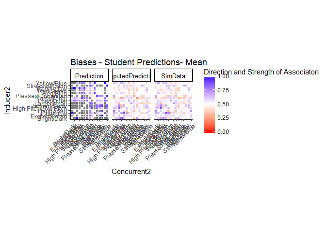
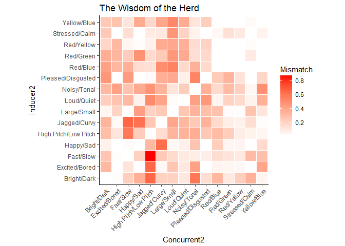
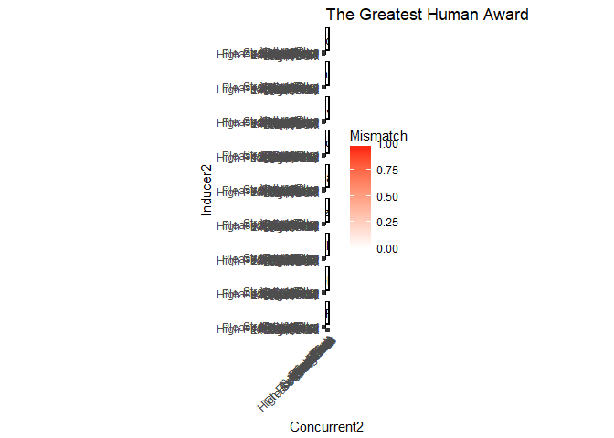

# Hypothesis Challenge Testing
Alan Nielsen  
September 23, 2017  

We are going to see how people did in the hypothesis challenge - oh what fun!


```r
library(tidyverse)
library(plyr)

cleandata <- read.csv(
"F:/Google Drive/GitHub Repos/STE-PHEN/summer_school_sessions/17_hypchall/cleandataN.csv")
```


```r
CleanDataAgg <- aggregate(Response ~ DataSet + Inducer + Concurrent + Comparison,
                     data= cleandata, mean)


Domains <- sort(unique(CleanDataAgg$Inducer))
HighValues <- c("Excited/Bored", "Happy/Sad", "Pleased/Disgusted", "Stressed/Calm",
                "Loud/Quiet", "Bright/Dark", "Red/Blue", "Red/Green", "Red/Yellow",
                "Yellow/Blue", "Noisy/Tonal", "High Pitch/Low Pitch", "Jagged/Curvy", 
                "Large/Small", "Fast/Slow")

CleanDataAgg$Inducer2 <- mapvalues(CleanDataAgg$Inducer, from = Domains, to= HighValues)
CleanDataAgg$Concurrent2 <- mapvalues(CleanDataAgg$Concurrent, from = Domains, to= HighValues)

MainDataAgg <- subset(CleanDataAgg, DataSet == "Main")
```


Now we need to start reading in student data so we can see how good of a job each student did at the task


```r
#List all of the files in the prediction directory

library(data.table)
```

```
## 
## Attaching package: 'data.table'
```

```
## The following objects are masked from 'package:dplyr':
## 
##     between, first, last
```

```
## The following object is masked from 'package:purrr':
## 
##     transpose
```

```r
setwd('F:/Google Drive/GitHub Repos/Ste-phen/summer_school_sessions/17_hypchall/Predictions/TheOne/')
files <- list.files('F:/Google Drive/GitHub Repos/Ste-phen/summer_school_sessions/17_hypchall/Predictions/TheOne/', pattern = ".csv")
temp <- lapply(files, fread, sep = ",")
StudentPredictions<- rbindlist(temp)


StudentPredictions$Source <- factor(StudentPredictions$Source, 
                                  level = c("Prediction", "ImputedPrediction", "SimData"))
```


One thing that might be simple to look at is just how wise the herd was - it's also a way to start looking at the data without telling you immediately who won- ooooooh SUSPENSE


```r
setwd('F:/Google Drive/GitHub Repos/Ste-phen/summer_school_sessions/17_hypchall/Predictions/TheOne/')

StudentPredictionsAgg <- aggregate(value ~ Source + Inducer2 + Concurrent2, 
                                   data = StudentPredictions, mean)

ggplot(data= StudentPredictionsAgg, aes(x=Concurrent2, y=Inducer2, fill=value)) +
  geom_tile(color = "white") +
  ggtitle("Biases - Student Predictions- Mean") +
  scale_fill_gradient2(low = "red", high = "blue", mid = "white", 
                       midpoint = 0.5, limit = c(0,1),
                       name="Direction and Strength of Associaton") +
  theme_classic()+ 
  theme(axis.text.x = element_text(angle = 45, vjust = 1, hjust = 1))+
  facet_grid( ~ Source) +
  theme(strip.text.y = element_text(size = 10, colour = "black", angle = 0)) +
  theme(strip.text.x = element_text(size = 10, colour = "black", angle = 0)) +
  coord_fixed()
```

<!-- -->

```r
ggsave("HerdMaps.png", plot = last_plot(), path = NULL, scale = 1, width = 12, height = 12, units = c("in", "cm", "mm"), dpi = 300)
```

So those are the predictions that were made by those who managed to send in predictions - but how good were they?

For the rest of the stuff below, we're going to use the Data that were simulated from the imputed predictions

So lets do a subtraction from the actual data to see what we have


```r
setwd('F:/Google Drive/GitHub Repos/Ste-phen/summer_school_sessions/17_hypchall/Predictions/TheOne/')

StudentSimData <- subset(StudentPredictionsAgg, Source == "SimData")

SimDiffData <- StudentSimData

SimDiffData$Source <- "Difference"
SimDiffData$value <- abs(MainDataAgg$Response - StudentSimData$value)

ggplot(data= SimDiffData, aes(x=Concurrent2, y=Inducer2, fill=value)) +
  geom_tile(color = "white") +
  ggtitle("The Wisdom of the Herd") +
  scale_fill_gradient2(low = "white", high = "red", 
                       name="Mismatch") +
  theme_classic()+ 
  theme(axis.text.x = element_text(angle = 45, vjust = 1, hjust = 1))+
  theme(strip.text.y = element_text(size = 10, colour = "black", angle = 0)) +
  theme(strip.text.x = element_text(size = 10, colour = "black", angle = 0)) +
  coord_fixed()
```

<!-- -->

```r
ggsave("HerdWisdom.png", plot = last_plot(), path = NULL, scale = 1, width = 12, height = 12, units = c("in", "cm", "mm"), dpi = 300)
```


So how wise was our herd? Maybe not very - but the variation in responses was pretty high

Plus you don't really care how wise the GROUP of you are- you want to know the victor


```r
setwd('F:/Google Drive/GitHub Repos/Ste-phen/summer_school_sessions/17_hypchall/Predictions/TheOne/')

StudentSims <- subset(StudentPredictions, Source == "SimData")

StudentDiffs <- StudentSims

StudentDiffs$Source <- "Difference"

repper <- length(unique(StudentDiffs$Student))

StudentDiffs$Actual <- rep(MainDataAgg$Response, repper)

StudentDiffs$Difference <- abs(StudentDiffs$Actual - StudentDiffs$value)

ggplot(data= StudentDiffs, aes(x=Concurrent2, y=Inducer2, fill=Difference)) +
  geom_tile(color = "white") +
  ggtitle("The Greatest Human Award") +
  scale_fill_gradient2(low = "white", high = "red", 
                       name="Mismatch") +
  theme_classic()+ 
  theme(axis.text.x = element_text(angle = 45, vjust = 1, hjust = 1))+
  theme(strip.text.y = element_text(size = 10, colour = "black", angle = 0)) +
  theme(strip.text.x = element_text(size = 10, colour = "black", angle = 0)) +
  facet_wrap(~Student, ncol = 1) +
  coord_fixed()
```

<!-- -->

```r
ggsave("GreatestHuman.png", plot = last_plot(), path = NULL, scale = 1, width = 6, height = 12, units = c("in", "cm", "mm"), dpi = 300)
```


So we might have an idea from looking at the graphs who has made the best predictions, but we need a nice summary statistic that we can look at - like the mean distance between the predictions and the actual data


```r
StudentDiffAgg <- aggregate(Difference ~ Student, data= StudentDiffs, mean)

StudentDiffAgg <- StudentDiffAgg[order(StudentDiffAgg$Difference),]

StudentDiffAgg
```

```
##     Student Difference
## 4    Jeroen  0.1343162
## 1  Ezequiel  0.1772658
## 3   Ian Joo  0.2342765
## 6    Kazuki  0.2633697
## 9    MIGBOR  0.2696970
## 8 MerelWolf  0.2801276
## 5       Kat  0.2807980
## 2    Hannah  0.3824239
## 7   MARIANN  0.4633166
```

So this tells us which students made the best predictions - we said the prize would go to whichever student who made the top 3 best predictions who made the least predictions themselves - so we need to know how many predictions each of the students made

We'll only consider this for the top 3 students


```r
StudentPreds <- subset(StudentPredictions, Source == "Prediction")

students <- unique(StudentDiffAgg$Student)
Predsmade <- list()

for(student in students){
  
  testdata <- subset(StudentPreds, Student == student)
  
  Preds <- (186 - sum(is.na(testdata$value)))
  
  Predsmade <- c(Predsmade, Preds)
      
}

StudentDiffAgg$Predictions <- Predsmade


StudentDiffAgg
```

```
##     Student Difference Predictions
## 4    Jeroen  0.1343162         146
## 1  Ezequiel  0.1772658         186
## 3   Ian Joo  0.2342765         186
## 6    Kazuki  0.2633697         186
## 9    MIGBOR  0.2696970         186
## 8 MerelWolf  0.2801276         154
## 5       Kat  0.2807980         110
## 2    Hannah  0.3824239         186
## 7   MARIANN  0.4633166          68
```


